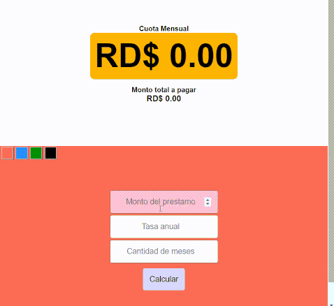

# Cálculo Cuota de Préstamo / Cambiar estilos de color `(CSS)`
Calculadora de cuota mensual de un préstamo, utilizando el método `.toLocalString()` para darle formato a los números.

## Probar app : https://johanjimenex.github.io/calculo-prestamo/

### Vista previa





`html`
``` html
<!DOCTYPE html>
<html lang="es">
<head>
    <meta charset="UTF-8">
    <meta name="viewport" content="width=device-width, initial-scale=1.0">
    <meta http-equiv="X-UA-Compatible" content="ie=edge">
    <link rel='stylesheet' href='misestilos.css'>
    <title>Document</title>
</head>
<body>
    <div class='container'>
        <div class='pa'>
            <h4>Cuota Mensual</h4>
            <h1>RD$ 0.00</h1>
            <h4>Monto total a pagar</h4>
            <h3>RD$ 0.00</h3>
        </div>
        <div id='caja'>

            <div id='tema'>
                <div id='tomato' class='bt'></div>
                <div id='dodgerblue' class='bt'></div>
                <div id='green' class='bt'></div>
                <div id='black' class='bt'></div>
            </div>

            <form id='formulario'>
                <input id='monto' type='number' placeholder='Monto del prestamo' required>
                <input id='tasa' type='number' placeholder='Tasa anual' required>
                <input id='tiempo' type='number' placeholder='Cantidad de meses' required>
                <button>Calcular</button>
            </form>
        </div>
    </div>
    <script src='app.js'></script>
</body>
</html>


```

`javascript`
``` javascript
var button = document.querySelector('button');
var tema = document.querySelector('#tema')

button.addEventListener('click', (e) => {
	e.preventDefault()

	var monto = Number(document.querySelector('#monto').value);
	var tasa = Number(document.querySelector('#tasa').value) / 12;
	var tiempo = Number(document.querySelector('#tiempo').value);


	var cuotaMensual = monto * (
		(Math.pow((1 + tasa / 100), tiempo) *
			(tasa / 100)
		) /
		(Math.pow((1 + tasa / 100), tiempo)
			- 1
		)
	);
	
	//Dar formato con comas y decimales
	//Nota: primero se deben hacer las operaciones matematicas deseadas antes de utilizar el metodo 'toLocalString()'
	var cuotaFormtaeada = cuotaMensual.toLocaleString("en-US", { style: "currency", currency: "USD" });
	var cuotaAnualFormateada = (cuotaMensual*tiempo).toLocaleString("en-US", { style: "currency", currency: "USD" });


	document.querySelector('h1').innerHTML = 'RD$ ' + cuotaFormtaeada;
	document.querySelector('h3').innerHTML = 'RD$ ' + cuotaAnualFormateada;

});

tema.addEventListener('click', (e) => {
	e.preventDefault()

	document.querySelector('#caja').style.background = e.target.id;

})
```
